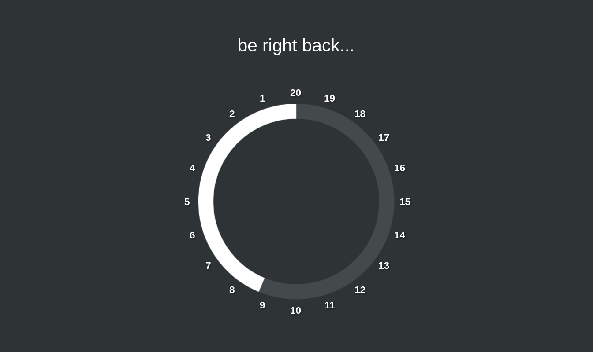
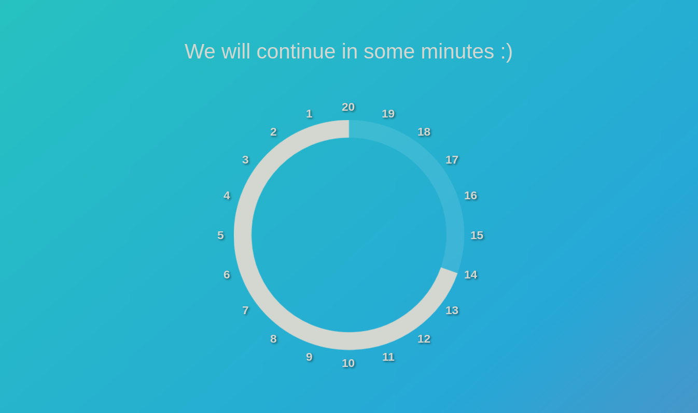
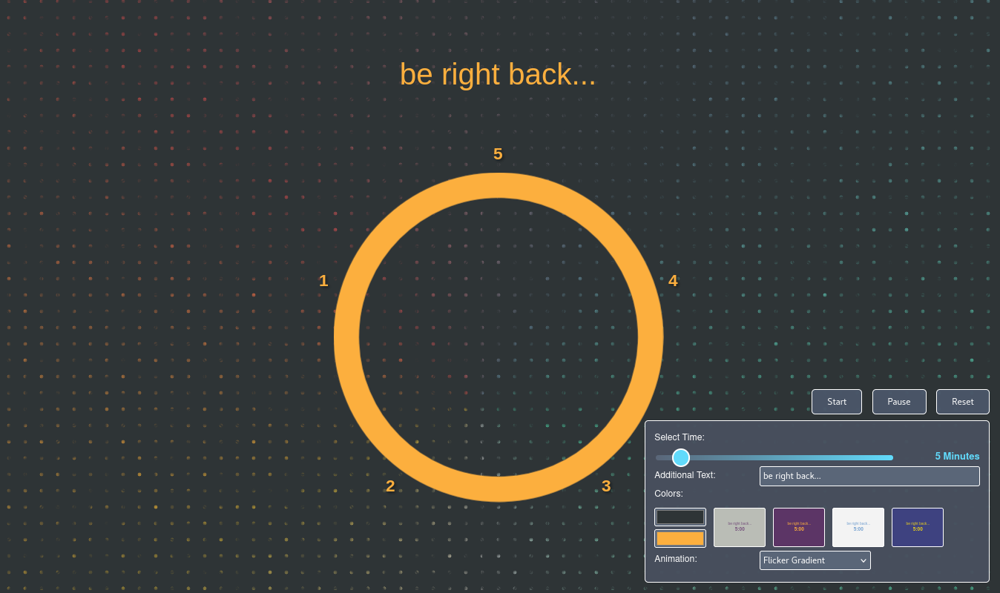
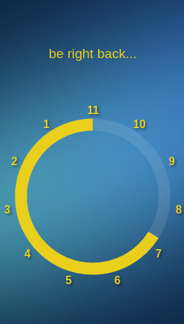
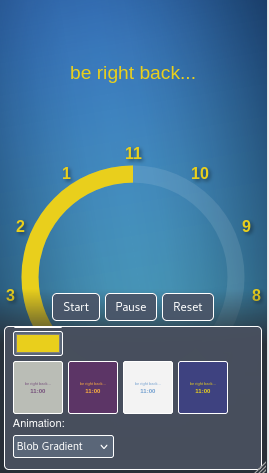

# Analog WebTimer

A minimalist, responsive analog countdown timer for the browser with a clock-style ring visualization, theme presets, and stunning background animations.

  
  

## Features

### Analog Clock Visualization
- **Ring Timer**: Visual countdown as a shrinking ring (donut chart), like an analog clock
- **Counter-Clockwise Direction**: The ring depletes counter-clockwise from the top (12 o'clock position)
- **Minute Labels**: Dynamic numbers positioned outside the ring showing remaining minutes
- **Smooth Animation**: Real-time updates every second with smooth transitions
- **Optimized Display**: Slim ring design and responsive label positioning for perfect visibility on all screen sizes

### Flexible Time Selection
- **Interactive Slider**: Choose any duration between 3 and 30 minutes
- **Real-Time Preview**: Slider shows gradient from gray to turquoise with live minute display
- **Multiple Input Methods**: Drag, click, or use mouse wheel to adjust time
- **Dynamic Clock Face**: The number of minute labels automatically adjusts to your selected duration
- **Instant Feedback**: Changes are reflected immediately on the timer visualization

  

### Timer Controls
- **Start/Pause Function**: Start and pause the timer at will
- **Reset**: Reset the timer to its initial state with full ring
- **Automatic Fade-Out Animation**: At the end of the countdown, the screen (including background animations) elegantly fades to black

### Customization Options
- **Additional Text**: Add a custom message displayed above the timer (e.g., "be right back...")
- **Color Customization**:
  - Background and ring colors via color pickers
  - 4 pre-defined theme buttons with instant preview
  - Live preview showing your text and selected time
- **Background Animations**: Optional choose from 3 stunning animations
  - Flicker Gradient (dynamic dotted gradient)
  - Gradient Wave (smooth color transitions)
  - Blob Gradient (animated organic shapes)
- **Settings Persistence**: All settings are automatically saved in your browser and will be applied on the next page visit
- **Real-Time Preview**: All changes are displayed instantly

### User Interface
- **Responsive Design**: Optimized for all screen sizes - from smartphone to desktop
- **Fullscreen Mode**: Ideal for breaks at meetings, presentations and lectures
- **Auto-Hide Controls**: Controls automatically hide when the timer is running and reappear on mouse movement
- **Bottom-Right Positioning**: Compact controls in the lower right corner for unobstructed view
- **Centered Display**: Timer and text perfectly centered on screen

  
  

## Usage

1. Open the `analog-timer.html` file in a modern web browser
2. Use the **slider** to select your desired time (anywhere from 3 to 30 minutes)
   - Drag the slider handle
   - Click on the slider track
   - Use your mouse wheel while hovering over the slider
3. Optionally customize:
   - Adjust the text displayed above the timer
   - Choose colors manually or click a theme preview button
   - Select a background animation from the dropdown (Flicker, Gradient Wave, or Blob)
4. Click "Start" to begin the countdown
5. Use "Pause" to halt and "Reset" to restart

### Tips
- Move your mouse over the lower right corner to display the controls during a running timer
- Use your browser's fullscreen mode (F11) for an even better presentation experience
- The ring depletes smoothly counter-clockwise, making the remaining time easy to see at a glance
- All settings (time, colors, animation, text) are saved automatically and restored on your next visit
- Try the theme preview buttons for quick color scheme changes - they update instantly with your current text and time
- Background animations add visual interest without distracting from the timer
- The minute labels around the clock automatically adjust to your selected duration
- On mobile devices, the controls appear at the bottom with a gradient background for better visibility

## Technical Details

- Pure HTML/CSS/JavaScript solution without external dependencies
- SVG-based ring chart with stroke-dasharray animation for crisp, scalable graphics
- Interactive HTML5 range slider with custom styling and mouse wheel support
- Dynamic label generation - adapts to any time duration (3-30 minutes)
- CSS animations for background effects (Flicker, Gradient Wave, Blob)
- LocalStorage API for persistent settings across sessions
- Responsive design with clamp() for fluid scaling across all devices
- Optimized ring dimensions for maximum visibility
- No installation required
- Works offline
- Compatible with all modern browsers (Chrome, Firefox, Safari, Edge)
- Smooth animations with CSS transitions and keyframes
- Efficient rendering with minimal CPU usage

## License

This project is licensed under the **GNU General Public License v3.0**.

This means:
- You can freely use, copy, and distribute the software
- You can modify the software and distribute your changes
- If you distribute modified versions, they must also be licensed under GPL v3.0
- The software is provided without warranty

For more details, see the [LICENSE](LICENSE) file or visit https://www.gnu.org/licenses/gpl-3.0.html

## Screenshot Overview

  
  

  <em>The analog ring timer in action with custom text and color variations</em>

  

  <em>Start, Pause, and Reset buttons with time slider and all customization options in the lower right corner</em>

  
  

  <em>Timer optimized for mobile devices and presentations</em>

## Contributions

Suggestions for improvement and contributions are welcome! Since this project is licensed under GPL v3.0, all contributions must also be published under this license.

---

**Analog WebTimer** - Your visual, ring-style countdown timer with stunning animations for the browser.
